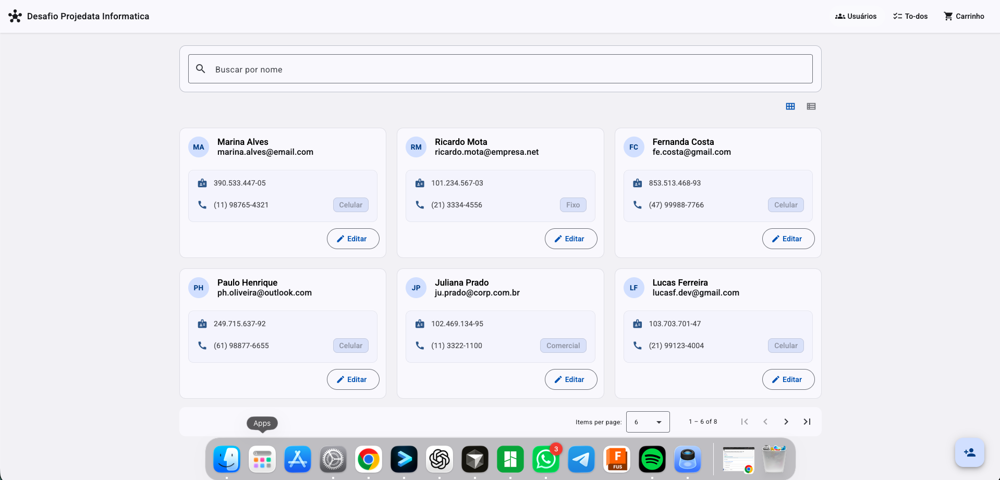

# Desafio Técnico - Projedata Informática

## Contexto

| Campo | Detalhe |
| --- | --- |
| **Empresa** | Projedata Informática Ltda. |
| **Vaga** | Desenvolvedor(a) Frontend |
| **Autor** | **Liniker Silva** · [contato@liniker.com.br](mailto:contato@liniker.com.br) |

Este repositório apresenta a solução do **desafio técnico** para a vaga de **Desenvolvedor Frontend** na **Projedata Informática Ltda.**, demonstrando organização do código, testes e uso de Angular moderno.

---

Aplicação Angular com **CRUD de usuários** (lista, busca com debounce, modal criar/editar), rota de **to-dos** com NgRx e página de **carrinho** com estado em signals.

## Captura de tela



## Stack

- Angular 19 (standalone)
- Angular Material
- RxJS na busca (`debounceTime`, `distinctUntilChanged`, `switchMap`, `catchError`, `finalize`)
- Signals no `UsersStore`
- Reactive Forms no modal de usuário
- NgRx (actions, effects, reducer, selectors) na feature to-dos
- Vitest + `@analogjs/vitest-angular` + `@vitest/coverage-v8`

## Como rodar

```bash
npm install
npm start
```

Abre em `http://localhost:4200/`.

Rotas principais:

- `/` — usuários
- `/todos` — lista de tarefas (NgRx)
- `/cart` — carrinho (exemplo com signals)

Build de produção:

```bash
npm run build
```

## Lista de usuários

- Busca por nome com debounce e paginação.
- **Duas visualizações:** grade de cartões ou lista compacta; alternância por ícones outlined (`Material Icons Outlined`) abaixo do card de busca. A preferência é salva em `localStorage` (`desafio.userList.viewMode`).
- FAB para novo usuário; edição por cartão/linha.

## Testes e cobertura

```bash
npm test
```

Com relatório em `coverage/` (HTML + texto):

```bash
npm run test:coverage
```

Os limites mínimos estão em `vite.config.mts` (statements/lines 60%, functions 55%, branches 50%). O relatório considera `src/app/**/*.ts`, excluindo `*.spec.ts`, `main.ts`, `test-setup.ts`, pastas `models/` e `data/`.

## Estrutura (resumo)

```
src/app/
  core/models/          tipos (User, PhoneKind)
  features/users/
    components/         lista (cards + lista) + dialog do formulário
    data/               mock fixo (excluído da cobertura)
    pages/              shell da rota
    services/           mock com delay
    store/              facade em signals
  features/todos/       página, store NgRx, efeitos, mock HTTP
  features/cart/        carrinho (signals, computed, output)
  shared/validators/    CPF e telefone BR
```

## Decisões rápidas

- **Store no provider da rota:** o `UsersStore` é fornecido em `app.routes.ts` só na rota de usuários.
- **Busca:** `toObservable` no signal + debounce; `switchMap` cancela requisição antiga.
- **Mock de usuários:** array em memória no service, com `timer` para latência. Há flag `simularFalhaNaBusca` para testar erro (desligada por padrão).
- **To-dos:** estado em NgRx; JSON em `public/todos-mock.json` carregado via HTTP no effect.
- **Testes:** `TestBed` inicializado em `src/test-setup.ts`. Após cada caso do dialog de usuário, o spec chama `TestBed.resetTestingModule()` para isolar providers.

## Observação

Os CPFs do mock passam no validador (dígitos verificadores). CPF inventado no formulário será rejeitado pelo campo.
